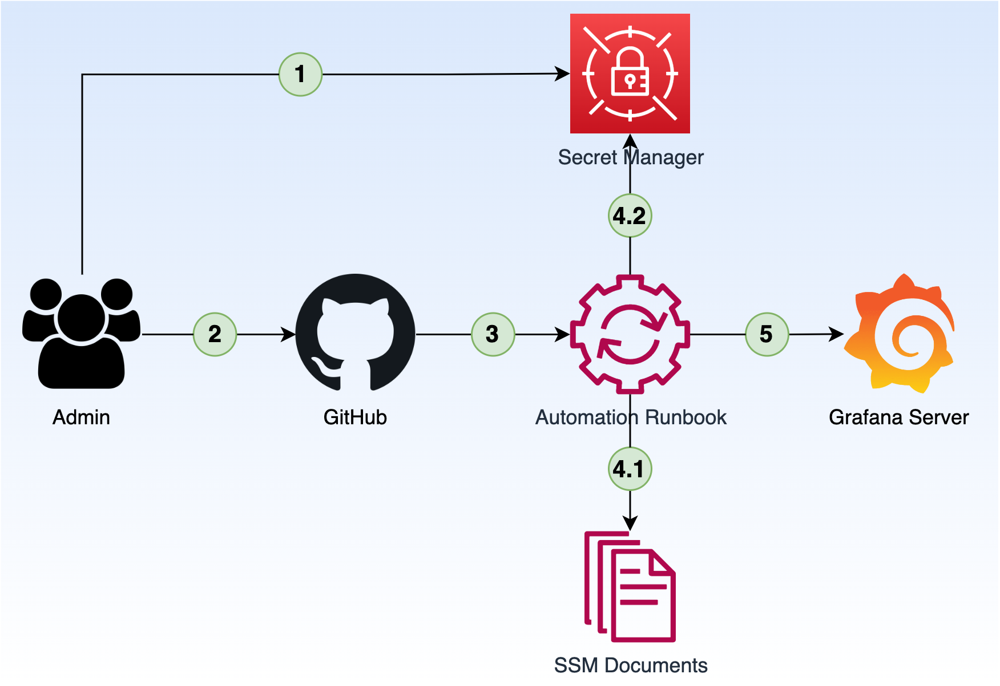

# Grafana Ops

## Movitation

Check out this post [A GitOps Way To Manage Grafana Data Sources At Scale](https://dev.to/aws-builders/a-gitops-way-to-manage-grafana-data-sources-at-scale-59la)

## High-level architecture



## Directory structure

```bash
.
├── README.md
├── aws-ssm-documents
│   ├── commands
│   │   ├── GH-CloneRepository
│   │   │   ├── GH-CloneRepository.yaml
│   │   │   └── README.md
│   │   └── ...
│   └── runbooks
│       └── GF-GenerateDataSources
│           ├── GF-UpdateDataSources.yaml
│           ├── README.md
│           └── role
│               ├── permission-policy.json
│               └── trusted-policy.json
├── datasources
│   ├── team-1
│   │   ├── clickhouse-example-2.yaml
│   │   └── cloudwatch-example-1.yaml
│   ├── team-2
│   │   ├── ...
│   ├── ...
└── scripts
    ├── generate-datasource.py
    └── get-secrets.py
    └── ...
```
